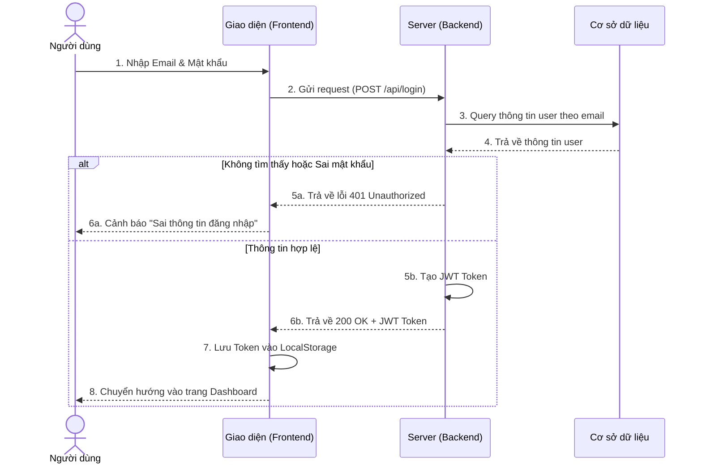

# CHƯƠNG 2: PHÂN TÍCH THIẾT KẾ HỆ THỐNG

## 2.1. Phân tích các yêu cầu về chức năng

### 2.1.1. Yêu cầu chức năng

Hệ thống quản lý trung tâm đào tạo EduTrack cần đáp ứng các yêu cầu chức năng sau:

**Đối với Quản trị viên (Admin):**
- Quản lý thông tin học viên (thêm, sửa, xóa, tìm kiếm)
- Quản lý thông tin giáo viên (thêm, sửa, xóa, tìm kiếm)
- Quản lý lớp học (tạo lớp, phân công giáo viên, đăng ký học viên)
- Quản lý cơ sở vật chất (phòng học, thiết bị)
- Quản lý học phí (theo dõi thanh toán, nhắc nợ)
- Quản lý lịch học (xếp lịch, điều chỉnh)
- Theo dõi điểm danh
- Quản lý liên hệ/tư vấn từ khách hàng
- Quản lý phân quyền người dùng
- Xem báo cáo thống kê (doanh thu, học viên, điểm danh)
- Quản lý hỗ trợ/ticket
- Theo dõi nhật ký hệ thống

**Đối với Giáo viên (Teacher):**
- Xem thông tin lớp học được phân công
- Điểm danh học viên
- Xem danh sách học viên trong lớp
- Xem lịch giảng dạy
- Quản lý tài liệu giảng dạy
- Tạo và quản lý đề thi/bài kiểm tra
- Nhập điểm cho học viên

**Đối với Học viên (Student/User):**
- Xem thông tin cá nhân
- Xem lịch học
- Xem điểm danh
- Xem điểm số
- Xem tài liệu học tập
- Xem thông tin học phí

### 2.1.2. Yêu cầu phi chức năng

**Hiệu năng:**
- Thời gian phản hồi trung bình < 2 giây
- Hỗ trợ tối thiểu 500 người dùng đồng thời
- Tải trang không quá 3 giây

**Bảo mật:**
- Mã hóa mật khẩu bằng bcrypt
- Xác thực bằng JWT token
- Phân quyền theo vai trò (RBAC)
- HTTPS cho mọi giao dịch
- Bảo vệ khỏi SQL Injection, XSS

**Khả năng mở rộng:**
- Kiến trúc module hóa
- API RESTful chuẩn
- Có thể tích hợp thêm module mới

**Khả dụng:**
- Uptime ≥ 99%
- Backup dữ liệu hàng ngày
- Khôi phục dữ liệu khi cần

**Giao diện:**
- Responsive trên mọi thiết bị
- Hỗ trợ tiếng Việt
- Thân thiện, dễ sử dụng

## 2.2. Xác định tác nhân và chức năng của hệ thống

### 2.2.1. Các tác nhân

| STT | Tác nhân | Mô tả | Vai trò |
|-----|----------|-------|---------|
| 1 | Admin | Quản trị viên hệ thống | Quản lý toàn bộ hệ thống, có quyền cao nhất |
| 2 | Teacher | Giáo viên | Quản lý lớp học, điểm danh, nhập điểm |
| 3 | Student | Học viên | Xem thông tin học tập, lịch học, điểm số |
| 4 | Guest | Khách truy cập | Xem thông tin giới thiệu, đăng ký tư vấn |

### 2.2.2. Các chức năng của hệ thống

**Nhóm chức năng Quản lý Người dùng:**
- Đăng nhập/Đăng xuất
- Quản lý hồ sơ cá nhân
- Đổi mật khẩu
- Phân quyền người dùng

**Nhóm chức năng Quản lý Học viên:**
- Thêm học viên mới
- Cập nhật thông tin học viên
- Xóa học viên
- Tìm kiếm học viên
- Xem danh sách học viên

**Nhóm chức năng Quản lý Giáo viên:**
- Thêm giáo viên mới
- Cập nhật thông tin giáo viên
- Xóa giáo viên
- Tìm kiếm giáo viên
- Xem danh sách giáo viên

**Nhóm chức năng Quản lý Lớp học:**
- Tạo lớp học mới
- Cập nhật thông tin lớp
- Xóa lớp học
- Phân công giáo viên
- Đăng ký học viên vào lớp
- Xem danh sách lớp

**Nhóm chức năng Quản lý Điểm danh:**
- Điểm danh học viên
- Xem lịch sử điểm danh
- Thống kê điểm danh
- Cảnh báo học viên vắng nhiều

**Nhóm chức năng Quản lý Học phí:**
- Ghi nhận thanh toán
- Xem lịch sử thanh toán
- Thống kê doanh thu
- Nhắc nợ học phí

**Nhóm chức năng Quản lý Lịch học:**
- Tạo lịch học
- Cập nhật lịch học
- Xem lịch học theo lớp/giáo viên
- Thông báo thay đổi lịch

**Nhóm chức năng Báo cáo & Thống kê:**
- Báo cáo doanh thu
- Báo cáo điểm danh
- Thống kê học viên
- Thống kê hiệu suất giáo viên

## 2.3. Biểu đồ Use Case

### 2.3.1. Biểu đồ Use Case tổng quát

**Mô tả:** Biểu đồ Use Case tổng quát thể hiện tất cả các chức năng chính của hệ thống và mối quan hệ với các tác nhân.

**Các Use Case chính:**
1. Quản lý Người dùng
2. Quản lý Học viên
3. Quản lý Giáo viên
4. Quản lý Lớp học
5. Quản lý Điểm danh
6. Quản lý Học phí
7. Quản lý Lịch học
8. Quản lý Cơ sở vật chất
9. Quản lý Liên hệ/Lead
10. Quản lý Báo cáo

**Tác nhân tương tác:**
- Admin: Tương tác với tất cả 10 use case
- Teacher: Tương tác với UC4, UC5, UC7
- Student: Tương tác với UC5, UC7 (chỉ xem)
- Guest: Tương tác với UC9 (đăng ký tư vấn)

### 2.3.2. Biểu đồ Use Case thứ cấp

**UC1: Quản lý Người dùng**
- UC1.1: Đăng nhập
- UC1.2: Đăng xuất
- UC1.3: Quản lý hồ sơ
- UC1.4: Đổi mật khẩu
- UC1.5: Phân quyền

**UC2: Quản lý Học viên**
- UC2.1: Thêm học viên
- UC2.2: Sửa thông tin học viên
- UC2.3: Xóa học viên
- UC2.4: Tìm kiếm học viên
- UC2.5: Xem danh sách học viên

**UC3: Quản lý Giáo viên**
- UC3.1: Thêm giáo viên
- UC3.2: Sửa thông tin giáo viên
- UC3.3: Xóa giáo viên
- UC3.4: Tìm kiếm giáo viên
- UC3.5: Xem danh sách giáo viên

**UC4: Quản lý Lớp học**
- UC4.1: Tạo lớp học
- UC4.2: Cập nhật lớp học
- UC4.3: Xóa lớp học
- UC4.4: Phân công giáo viên
- UC4.5: Đăng ký học viên

### 2.3.3. Biểu đồ Use Case phân rã

**UC2.1: Thêm học viên (phân rã)**
- UC2.1.1: Nhập thông tin cơ bản
- UC2.1.2: Nhập thông tin liên hệ
- UC2.1.3: Upload ảnh đại diện
- UC2.1.4: Chọn lớp học
- UC2.1.5: Xác nhận và lưu

**UC5: Quản lý Điểm danh (phân rã)**
- UC5.1: Chọn lớp học
- UC5.2: Chọn buổi học
- UC5.3: Điểm danh từng học viên
- UC5.4: Ghi chú (nếu có)
- UC5.5: Lưu kết quả điểm danh

**UC6: Quản lý Học phí (phân rã)**
- UC6.1: Xem danh sách học phí
- UC6.2: Ghi nhận thanh toán
- UC6.3: In hóa đơn
- UC6.4: Gửi nhắc nợ
- UC6.5: Xem lịch sử thanh toán

### 2.3.4. Mối quan hệ giữa các Use Case

**Include (bao gồm):**
- UC2.1 (Thêm học viên) <<include>> UC1.1 (Đăng nhập)
- UC3.1 (Thêm giáo viên) <<include>> UC1.1 (Đăng nhập)
- UC4.1 (Tạo lớp học) <<include>> UC1.1 (Đăng nhập)
- UC5 (Điểm danh) <<include>> UC1.1 (Đăng nhập)

**Extend (mở rộng):**
- UC2.1 (Thêm học viên) <<extend>> UC2.1.3 (Upload ảnh)
- UC6.2 (Ghi nhận thanh toán) <<extend>> UC6.3 (In hóa đơn)
- UC5.3 (Điểm danh) <<extend>> UC5.4 (Ghi chú)

**Generalization (tổng quát hóa):**
- UC2 (Quản lý Học viên) là tổng quát của UC2.1, UC2.2, UC2.3, UC2.4, UC2.5
- UC3 (Quản lý Giáo viên) là tổng quát của UC3.1, UC3.2, UC3.3, UC3.4, UC3.5

## 2.4. Mô tả chi tiết các Use Case

### UC1.1: Đăng nhập

**Tên Use Case:** Đăng nhập hệ thống

**Actor:** Admin, Teacher, Student

**Mô tả:** Người dùng đăng nhập vào hệ thống bằng email và mật khẩu

**Tiền điều kiện:**
- Người dùng đã có tài khoản trong hệ thống
- Hệ thống đang hoạt động bình thường

**Hậu điều kiện:**
- Người dùng được xác thực và chuyển đến trang chủ tương ứng với vai trò
- Phiên làm việc được tạo với JWT token

**Luồng chính:**
1. Người dùng truy cập trang đăng nhập
2. Hệ thống hiển thị form đăng nhập
3. Người dùng nhập email và mật khẩu
4. Người dùng nhấn nút "Đăng nhập"
5. Hệ thống xác thực thông tin
6. Hệ thống tạo JWT token
7. Hệ thống chuyển hướng theo vai trò:
   - Admin → Admin Dashboard
   - Teacher → Teacher Dashboard
   - Student → Student Dashboard

**Luồng thay thế:**
- 5a. Email không tồn tại:
  - Hệ thống hiển thị "Email không tồn tại"
  - Quay lại bước 3
- 5b. Mật khẩu sai:
  - Hệ thống hiển thị "Mật khẩu không đúng"
  - Quay lại bước 3
- 5c. Tài khoản bị khóa:
  - Hệ thống hiển thị "Tài khoản đã bị khóa"
  - Kết thúc use case

**Sơ đồ luồng xử lý Đăng nhập (vẽ bằng Mermaid - Cách 2):**

**Sơ đồ luồng xử lý Đăng nhập (vẽ bằng Draw.io - Cách 1):**

> 💡 **Mẹo:** Tôi đã tạo sẵn một file Draw.io mẫu tại `docs/uc_dang_nhap.drawio` trong thư mục dự án của bạn! Bạn chỉ cần cài extension "Draw.io Integration" trong VS Code, sau đó nhấp đúp vào file đó ở cột bên trái là có thể tự do kéo thả, chỉnh sửa sơ đồ được ngay.

### UC2.1: Thêm học viên

**Tên Use Case:** Thêm học viên mới

**Actor:** Admin

**Mô tả:** Admin thêm thông tin học viên mới vào hệ thống

**Tiền điều kiện:**
- Admin đã đăng nhập
- Admin có quyền quản lý học viên

**Hậu điều kiện:**
- Học viên mới được lưu vào database
- Tài khoản đăng nhập được tạo cho học viên
- Email thông báo được gửi đến học viên (nếu có email)

**Luồng chính:**
1. Admin chọn menu "Quản lý Học viên"
2. Hệ thống hiển thị danh sách học viên
3. Admin nhấn nút "Thêm học viên"
4. Hệ thống hiển thị form nhập thông tin
5. Admin nhập thông tin:
   - Họ tên (bắt buộc)
   - Ngày sinh (bắt buộc)
   - Giới tính
   - Số điện thoại (bắt buộc)
   - Email
   - Địa chỉ
   - Số điện thoại phụ huynh
6. Admin upload ảnh đại diện (tùy chọn)
7. Admin chọn lớp học (tùy chọn)
8. Admin nhấn "Lưu"
9. Hệ thống validate dữ liệu
10. Hệ thống lưu thông tin
11. Hệ thống tạo tài khoản đăng nhập
12. Hệ thống hiển thị thông báo thành công
13. Hệ thống quay về danh sách học viên

**Luồng thay thế:**
- 9a. Dữ liệu không hợp lệ:
  - Hệ thống hiển thị lỗi cụ thể
  - Quay lại bước 5
- 9b. Số điện thoại đã tồn tại:
  - Hệ thống hiển thị "Số điện thoại đã được sử dụng"
  - Quay lại bước 5
- 9c. Email đã tồn tại:
  - Hệ thống hiển thị "Email đã được sử dụng"
  - Quay lại bước 5

### UC4.1: Tạo lớp học

**Tên Use Case:** Tạo lớp học mới

**Actor:** Admin

**Mô tả:** Admin tạo lớp học mới trong hệ thống

**Tiền điều kiện:**
- Admin đã đăng nhập
- Có ít nhất một giáo viên trong hệ thống
- Có phòng học khả dụng

**Hậu điều kiện:**
- Lớp học mới được tạo
- Giáo viên được phân công (nếu có)
- Lịch học được tạo

**Luồng chính:**
1. Admin chọn "Quản lý Lớp học"
2. Hệ thống hiển thị danh sách lớp
3. Admin nhấn "Tạo lớp mới"
4. Hệ thống hiển thị form
5. Admin nhập thông tin:
   - Tên lớp (bắt buộc)
   - Môn học (bắt buộc)
   - Sĩ số tối đa
   - Ngày bắt đầu
   - Ngày kết thúc
   - Học phí
6. Admin chọn giáo viên
7. Admin chọn phòng học
8. Admin chọn lịch học (thứ, giờ)
9. Admin nhấn "Lưu"
10. Hệ thống validate
11. Hệ thống lưu lớp học
12. Hệ thống tạo lịch học
13. Hệ thống thông báo thành công

**Luồng thay thế:**
- 10a. Tên lớp đã tồn tại:
  - Hiển thị lỗi
  - Quay lại bước 5
- 10b. Giáo viên không khả dụng:
  - Hiển thị "Giáo viên đã có lịch trùng"
  - Quay lại bước 6
- 10c. Phòng học không khả dụng:
  - Hiển thị "Phòng đã được đặt"
  - Quay lại bước 7

### UC5: Điểm danh học viên

**Tên Use Case:** Điểm danh học viên

**Actor:** Teacher

**Mô tả:** Giáo viên điểm danh học viên trong buổi học

**Tiền điều kiện:**
- Giáo viên đã đăng nhập
- Có lớp học được phân công
- Đã đến giờ học

**Hậu điều kiện:**
- Kết quả điểm danh được lưu
- Thống kê điểm danh được cập nhật

**Luồng chính:**
1. Giáo viên chọn "Điểm danh"
2. Hệ thống hiển thị danh sách lớp
3. Giáo viên chọn lớp
4. Hệ thống hiển thị danh sách học viên
5. Giáo viên đánh dấu từng học viên:
   - Có mặt
   - Vắng có phép
   - Vắng không phép
   - Đi muộn
6. Giáo viên ghi chú (nếu cần)
7. Giáo viên nhấn "Lưu"
8. Hệ thống lưu kết quả
9. Hệ thống cập nhật thống kê
10. Hệ thống thông báo thành công

**Luồng thay thế:**
- 7a. Chưa điểm danh đủ:
  - Hiển thị cảnh báo
  - Cho phép tiếp tục hoặc quay lại

## 2.5. Thiết kế Use Case

### Thiết kế logic xử lý

**Quy trình xác thực (Authentication Flow):**
1. User gửi credentials (email, password)
2. System validate format
3. System query database
4. System compare hashed password
5. System generate JWT token
6. System return token + user info
7. Client store token in localStorage
8. Client attach token to subsequent requests

**Quy trình CRUD cơ bản:**
1. Client gửi request với JWT token
2. Server verify token
3. Server check permissions
4. Server validate input data
5. Server execute database operation
6. Server return result
7. Client update UI

**Liên kết giữa các Use Case:**
- Tất cả UC yêu cầu UC1.1 (Đăng nhập) trước
- UC4.1 (Tạo lớp) liên kết UC3 (Chọn giáo viên)
- UC4.5 (Đăng ký học viên) liên kết UC2 (Chọn học viên)
- UC6 (Học phí) liên kết UC2 (Thông tin học viên)

## 2.6. Thiết kế cơ sở dữ liệu

### 2.6.1. Mô hình cơ sở dữ liệu (ERD)

**Các thực thể chính:**
1. Users (Người dùng)
2. Students (Học viên)
3. Teachers (Giáo viên)
4. Classes (Lớp học)
5. Enrollments (Đăng ký học)
6. Attendance (Điểm danh)
7. Payments (Thanh toán)
8. Schedules (Lịch học)
9. Facilities (Cơ sở vật chất)
10. Rooms (Phòng học)
11. Leads (Liên hệ/Tư vấn)
12. Roles (Vai trò)
13. Permissions (Quyền hạn)

**Mối quan hệ:**
- Users (1) - (1) Students: Một user là một học viên
- Users (1) - (1) Teachers: Một user là một giáo viên
- Users (N) - (1) Roles: Nhiều user có một vai trò
- Teachers (1) - (N) Classes: Một giáo viên dạy nhiều lớp
- Students (N) - (N) Classes: Nhiều-nhiều qua Enrollments
- Classes (1) - (N) Attendance: Một lớp có nhiều buổi điểm danh
- Students (1) - (N) Payments: Một học viên có nhiều thanh toán
- Classes (1) - (N) Schedules: Một lớp có nhiều buổi học
- Facilities (1) - (N) Rooms: Một cơ sở có nhiều phòng
- Rooms (1) - (N) Classes: Một phòng chứa nhiều lớp

### 2.6.2. Chi tiết các bảng

**Bảng: users**
| Tên cột | Kiểu dữ liệu | Ràng buộc | Mô tả |
|---------|--------------|-----------|-------|
| id | INT | PK, AUTO_INCREMENT | ID người dùng |
| email | VARCHAR(255) | UNIQUE, NOT NULL | Email đăng nhập |
| password | VARCHAR(255) | NOT NULL | Mật khẩu đã hash |
| role_id | INT | FK(roles.id) | Vai trò |
| status | ENUM | 'active','inactive' | Trạng thái |
| created_at | TIMESTAMP | DEFAULT CURRENT_TIMESTAMP | Ngày tạo |
| updated_at | TIMESTAMP | ON UPDATE | Ngày cập nhật |

**Bảng: students**
| Tên cột | Kiểu dữ liệu | Ràng buộc | Mô tả |
|---------|--------------|-----------|-------|
| id | INT | PK, AUTO_INCREMENT | ID học viên |
| user_id | INT | FK(users.id), UNIQUE | ID người dùng |
| full_name | VARCHAR(255) | NOT NULL | Họ tên |
| date_of_birth | DATE | NOT NULL | Ngày sinh |
| gender | ENUM | 'male','female','other' | Giới tính |
| phone | VARCHAR(20) | UNIQUE, NOT NULL | Số điện thoại |
| parent_phone | VARCHAR(20) | | SĐT phụ huynh |
| address | TEXT | | Địa chỉ |
| avatar | VARCHAR(255) | | Đường dẫn ảnh |
| enroll_date | DATE | DEFAULT CURRENT_DATE | Ngày nhập học |
| status | ENUM | 'active','inactive' | Trạng thái |
| created_at | TIMESTAMP | | Ngày tạo |
| updated_at | TIMESTAMP | | Ngày cập nhật |

**Bảng: teachers**
| Tên cột | Kiểu dữ liệu | Ràng buộc | Mô tả |
|---------|--------------|-----------|-------|
| id | INT | PK, AUTO_INCREMENT | ID giáo viên |
| user_id | INT | FK(users.id), UNIQUE | ID người dùng |
| full_name | VARCHAR(255) | NOT NULL | Họ tên |
| phone | VARCHAR(20) | UNIQUE, NOT NULL | Số điện thoại |
| subjects | JSON | | Môn dạy |
| avatar | VARCHAR(255) | | Ảnh đại diện |
| join_date | DATE | | Ngày vào làm |
| status | ENUM | 'active','inactive','on_leave' | Trạng thái |
| created_at | TIMESTAMP | | Ngày tạo |
| updated_at | TIMESTAMP | | Ngày cập nhật |

**Bảng: classes**
| Tên cột | Kiểu dữ liệu | Ràng buộc | Mô tả |
|---------|--------------|-----------|-------|
| id | INT | PK, AUTO_INCREMENT | ID lớp |
| name | VARCHAR(255) | UNIQUE, NOT NULL | Tên lớp |
| subject | VARCHAR(100) | NOT NULL | Môn học |
| teacher_id | INT | FK(teachers.id) | Giáo viên |
| room_id | INT | FK(rooms.id) | Phòng học |
| max_students | INT | DEFAULT 20 | Sĩ số tối đa |
| tuition_fee | DECIMAL(10,2) | | Học phí |
| start_date | DATE | | Ngày bắt đầu |
| end_date | DATE | | Ngày kết thúc |
| schedule | VARCHAR(255) | | Lịch học |
| status | ENUM | 'active','completed','upcoming','cancelled' | Trạng thái |
| created_at | TIMESTAMP | | Ngày tạo |
| updated_at | TIMESTAMP | | Ngày cập nhật |

**Bảng: enrollments**
| Tên cột | Kiểu dữ liệu | Ràng buộc | Mô tả |
|---------|--------------|-----------|-------|
| id | INT | PK, AUTO_INCREMENT | ID đăng ký |
| student_id | INT | FK(students.id) | Học viên |
| class_id | INT | FK(classes.id) | Lớp học |
| enroll_date | DATE | DEFAULT CURRENT_DATE | Ngày đăng ký |
| status | ENUM | 'active','completed','dropped' | Trạng thái |
| created_at | TIMESTAMP | | Ngày tạo |

**Bảng: attendance**
| Tên cột | Kiểu dữ liệu | Ràng buộc | Mô tả |
|---------|--------------|-----------|-------|
| id | INT | PK, AUTO_INCREMENT | ID điểm danh |
| class_id | INT | FK(classes.id) | Lớp học |
| student_id | INT | FK(students.id) | Học viên |
| date | DATE | NOT NULL | Ngày học |
| status | ENUM | 'present','absent','late','excused' | Trạng thái |
| notes | TEXT | | Ghi chú |
| created_by | INT | FK(users.id) | Người điểm danh |
| created_at | TIMESTAMP | | Thời gian |

**Bảng: payments**
| Tên cột | Kiểu dữ liệu | Ràng buộc | Mô tả |
|---------|--------------|-----------|-------|
| id | INT | PK, AUTO_INCREMENT | ID thanh toán |
| student_id | INT | FK(students.id) | Học viên |
| class_id | INT | FK(classes.id) | Lớp học |
| amount | DECIMAL(10,2) | NOT NULL | Số tiền |
| due_date | DATE | | Hạn thanh toán |
| paid_date | DATE | | Ngày thanh toán |
| method | VARCHAR(50) | | Phương thức |
| status | ENUM | 'paid','pending','overdue','cancelled' | Trạng thái |
| invoice_number | VARCHAR(50) | UNIQUE | Số hóa đơn |
| created_at | TIMESTAMP | | Ngày tạo |

**Bảng: facilities**
| Tên cột | Kiểu dữ liệu | Ràng buộc | Mô tả |
|---------|--------------|-----------|-------|
| id | INT | PK, AUTO_INCREMENT | ID cơ sở |
| name | VARCHAR(255) | NOT NULL | Tên cơ sở |
| address | TEXT | | Địa chỉ |
| phone | VARCHAR(20) | | Số điện thoại |
| manager | VARCHAR(255) | | Người quản lý |
| capacity | INT | | Sức chứa |
| status | ENUM | 'active','inactive','maintenance' | Trạng thái |

**Bảng: rooms**
| Tên cột | Kiểu dữ liệu | Ràng buộc | Mô tả |
|---------|--------------|-----------|-------|
| id | INT | PK, AUTO_INCREMENT | ID phòng |
| facility_id | INT | FK(facilities.id) | Cơ sở |
| name | VARCHAR(100) | NOT NULL | Tên phòng |
| capacity | INT | | Sức chứa |
| equipment | TEXT | | Thiết bị |
| floor | INT | | Tầng |
| status | ENUM | 'available','occupied','maintenance' | Trạng thái |

**Bảng: leads**
| Tên cột | Kiểu dữ liệu | Ràng buộc | Mô tả |
|---------|--------------|-----------|-------|
| id | INT | PK, AUTO_INCREMENT | ID lead |
| name | VARCHAR(255) | NOT NULL | Họ tên |
| phone | VARCHAR(20) | NOT NULL | SĐT |
| email | VARCHAR(255) | | Email |
| need | TEXT | | Nhu cầu |
| source | VARCHAR(50) | | Nguồn |
| status | ENUM | 'new','contacted','consulting','converted','lost' | Trạng thái |
| assigned_to | INT | FK(users.id) | Người phụ trách |
| notes | TEXT | | Ghi chú |
| created_at | TIMESTAMP | | Ngày tạo |

## 2.7. Thiết kế giao diện, hình dung màn hình

### Màn hình đăng nhập
**Chức năng:** Xác thực người dùng
**Thành phần:**
- Logo hệ thống
- Form nhập email
- Form nhập mật khẩu
- Nút "Đăng nhập"
- Link "Quên mật khẩu"
**Đặc điểm:** Giao diện đơn giản, tập trung, responsive

### Màn hình Admin Dashboard
**Chức năng:** Tổng quan hệ thống
**Thành phần:**
- Header: Logo, menu, thông tin user
- Sidebar: Menu chức năng
- Nội dung chính:
  - 4 KPI cards (Tổng học viên, Doanh thu, Tỷ lệ điểm danh, Lớp đang học)
  - Biểu đồ doanh thu theo tháng
  - Biểu đồ phân bố học viên
  - Bảng học viên mới nhất
**Đặc điểm:** Dashboard hiện đại, nhiều màu sắc, charts trực quan

### Màn hình Quản lý Học viên
**Chức năng:** CRUD học viên
**Thành phần:**
- Header với nút "Thêm học viên"
- Thanh tìm kiếm và filter
- Bảng danh sách học viên:
  - Avatar
  - Họ tên
  - Số điện thoại
  - Lớp học
  - Trạng thái học phí
  - Actions (Sửa, Xóa, Xem chi tiết)
- Pagination
**Đặc điểm:** Table responsive, có sort, filter, search

### Màn hình Quản lý Lớp học
**Chức năng:** CRUD lớp học
**Thành phần:**
- Grid/List view toggle
- Filter theo môn học, giáo viên, trạng thái
- Card lớp học hiển thị:
  - Tên lớp
  - Giáo viên
  - Số học viên/Sĩ số
  - Lịch học
  - Progress bar
  - Trạng thái
**Đặc điểm:** Card-based layout, visual progress

### Màn hình Điểm danh
**Chức năng:** Giáo viên điểm danh
**Thành phần:**
- Dropdown chọn lớp
- Date picker chọn ngày
- Danh sách học viên với:
  - Avatar
  - Họ tên
  - Buttons: Có mặt / Vắng / Đi muộn
  - Ô ghi chú
- Nút "Lưu điểm danh"
**Đặc điểm:** Mobile-friendly, quick actions

### Màn hình Báo cáo & Thống kê
**Chức năng:** Xem báo cáo
**Thành phần:**
- Tabs: Doanh thu, Điểm danh, Học viên, Giáo viên
- Date range picker
- Export buttons (PDF, Excel)
- Charts:
  - Line chart: Doanh thu theo thời gian
  - Bar chart: Điểm danh theo lớp
  - Pie chart: Phân bố học viên
- Summary tables
**Đặc điểm:** Data visualization, interactive charts

### Màn hình Teacher Dashboard
**Chức năng:** Tổng quan giáo viên
**Thành phần:**
- Lịch giảng dạy tuần này
- Danh sách lớp đang dạy
- Thống kê điểm danh
- Quick actions: Điểm danh, Nhập điểm
**Đặc điểm:** Focused on teaching tasks

### Màn hình Student Portal
**Chức năng:** Xem thông tin học tập
**Thành phần:**
- Thông tin cá nhân
- Lịch học
- Bảng điểm
- Lịch sử điểm danh
- Thông tin học phí
**Đặc điểm:** Read-only, student-friendly

---

## TỔNG KẾT CHƯƠNG 2

Chương 2 đã trình bày chi tiết về phân tích và thiết kế hệ thống quản lý trung tâm đào tạo EduTrack, bao gồm:

**Về phân tích yêu cầu:**
- Đã xác định đầy đủ các yêu cầu chức năng cho 3 nhóm người dùng chính (Admin, Teacher, Student)
- Đã phân tích các yêu cầu phi chức năng về hiệu năng, bảo mật, khả năng mở rộng

**Về Use Case:**
- Đã xác định 4 tác nhân chính và 10 nhóm chức năng lớn
- Đã xây dựng hệ thống Use Case từ tổng quát đến chi tiết
- Đã mô tả chi tiết 5 Use Case quan trọng nhất với đầy đủ luồng chính và luồng thay thế

**Về thiết kế cơ sở dữ liệu:**
- Đã thiết kế 13 bảng dữ liệu với đầy đủ ràng buộc
- Đã xác định rõ các mối quan hệ giữa các thực thể
- Thiết kế đảm bảo tính toàn vẹn dữ liệu và khả năng mở rộng

**Về thiết kế giao diện:**
- Đã mô tả 8 màn hình chính của hệ thống
- Giao diện được thiết kế theo hướng hiện đại, responsive, user-friendly
- Đảm bảo trải nghiệm người dùng tốt trên mọi thiết bị

Với thiết kế này, hệ thống EduTrack có thể đáp ứng đầy đủ nhu cầu quản lý của một trung tâm đào tạo quy mô vừa và nhỏ, đồng thời có khả năng mở rộng trong tương lai.
